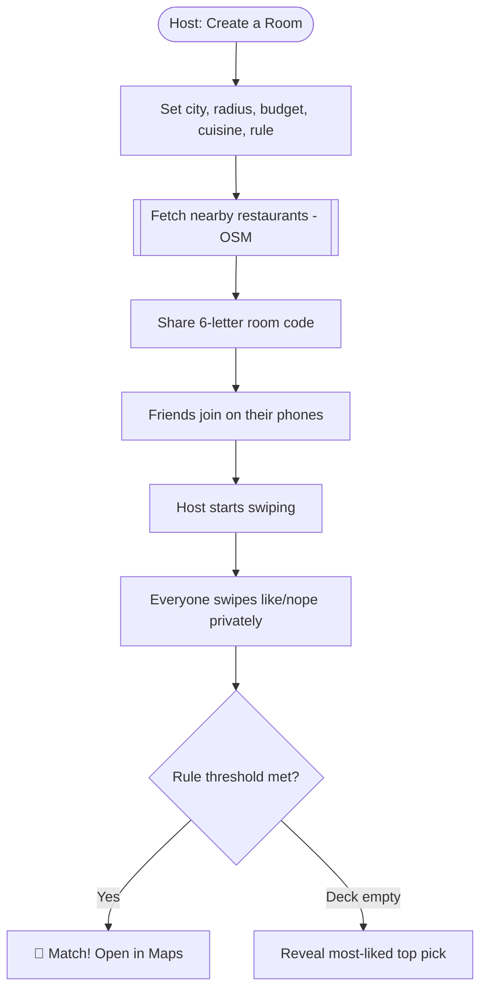
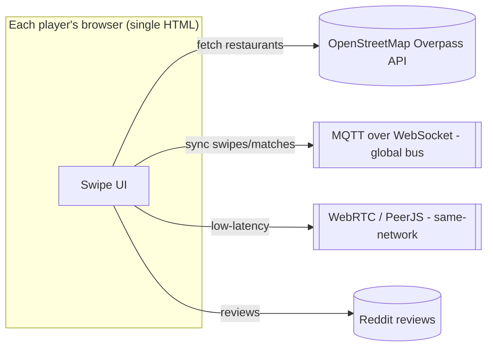
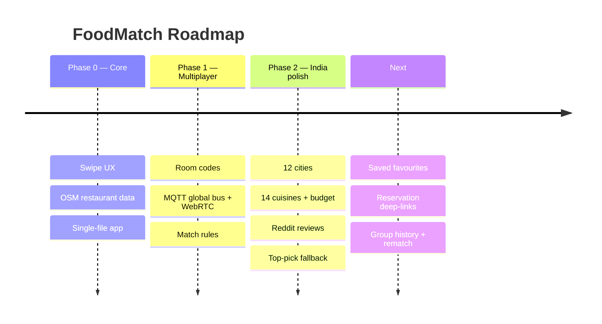
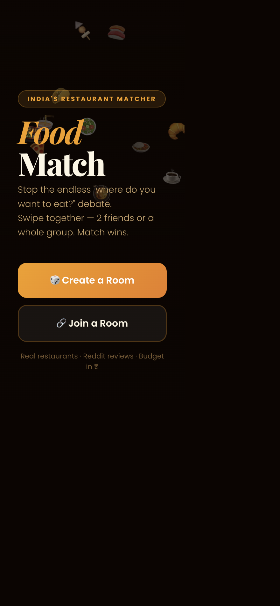

# FoodMatch India — Product Requirements Document & Case Study

> **End the "where do you want to eat?" debate.** A Tinder-style group restaurant matcher — everyone swipes on nearby places, first mutual match wins.

| | |
|---|---|
| **Live app** | https://aastha381.github.io/tinder-style-restaurant-matcher/ |
| **Repository** | https://github.com/AASTHA381/tinder-style-restaurant-matcher |
| **Author** | Aastha Saini |
| **Status** | Shipped (single-file web app) |
| **Type** | 0→1 consumer social / real-time multiplayer |
| **Doc version** | 1.0 |

---

## 1. TL;DR (Loom-style walkthrough script)

> *This is FoodMatch. Deciding where to eat as a group is a genuinely painful, endless negotiation — "anywhere", "you pick", "not that one". FoodMatch turns it into a game.*
>
> *One person creates a room with a city, budget and cuisine filters; it pulls real nearby restaurants from OpenStreetMap. Everyone joins on their own phone and swipes Tinder-style — like or nope. The moment enough people like the same place, confetti fires and that's dinner. It works across any network using a lightweight real-time bus, has 12 Indian cities, ₹ budgets and even Reddit reviews on each card. Zero install, no account — just open and swipe together.*

**Elevator pitch:** *Tinder for "where should we eat" — swipe together, first match wins.*

---

## 2. Problem Statement

Choosing a place to eat as a group is a slow, low-stakes-but-high-friction negotiation with **no fair mechanism** — someone always over-decides or no one decides.

**The core problem:**
> Groups lack a fast, fair, fun way to converge on a restaurant everyone's happy with — so the decision drags or defaults to one loud voice.

**Signals:**
- Universal "where do you want to eat?" loop.
- Group chats full of indecision.
- Existing food apps optimise ordering, not *group choosing*.

**Hypothesis:**
> If everyone swipes privately and the app surfaces the first mutual match, groups decide faster and feel it's fair — and enjoy it.

---

## 3. Research

### 3.1 Insights
| # | Insight | Implication |
|---|---------|-------------|
| 1 | Public voting biases to loud voices. | **Private swipes**, revealed only on match. |
| 2 | Fairness needs a clear rule. | Choose **Majority** vs **Everyone agrees**. |
| 3 | People are on different networks. | Real-time bus that works **across any network**. |
| 4 | Zero-install lowers the barrier. | **Single HTML file**, no account. |
| 5 | Local relevance matters (India). | 12 cities, ₹ budgets, Indian cuisines. |
| 6 | Trust in a place needs social proof. | **Reddit reviews** on cards. |

### 3.2 Competitive landscape
| Alternative | Reality | Gap FoodMatch fills |
|---|---|---|
| Group chat debate | Slow, unfair, no data | Fast, fair, real restaurant data |
| Food delivery apps | For ordering, solo | Group *decision* layer |
| Poll apps | Generic, not location-aware | Swipe UX + live nearby places |

---

## 4. User Personas

### Primary — "Indecisive group of friends" 🎯
| Attribute | Detail |
|---|---|
| Who | 2–N friends planning to eat out |
| Pain | Endless back-and-forth, someone always unhappy |
| Goal | Pick a place fast that everyone's okay with |
| Wins | Swipe together → instant fair match |

### Secondary — "The organiser" 🧭
Wants to host, set rules, and get everyone to commit quickly.

---

## 5. Goals & Success Metrics

### North Star Metric
> **Successful matches reached** (a group converges on a restaurant).

### Supporting metrics (proposed)
| Category | Metric | Target |
|---|---|---|
| Activation | % rooms that reach ≥2 players | ≥ 60% |
| Core value | % sessions ending in a match | ≥ 70% |
| Speed | Median time to match | < 3 min |
| Virality | Avg players per room | ≥ 3 |
| Delight | Repeat rooms per group | Trending up |

### Guardrails
- Cross-network reliability; fast restaurant load; no account/PII.

---

## 6. Solution & MVP Scope

**Solution:** A zero-install web app where a host creates a room, everyone swipes on real nearby restaurants on their own device, and the first mutual match (by chosen rule) wins.

### MVP (shipped)
| Capability | Description |
|---|---|
| 💚 **Tinder swipe** | Drag left/right on restaurant cards |
| 👥 **Group matching (2–N)** | Majority-agree or everyone-agree rule |
| 🎉 **Real-time match** | Confetti on threshold; "top pick" if deck ends |
| 📍 **Live data** | OpenStreetMap Overpass API (free, no key) |
| 🌐 **Any-network play** | MQTT-over-WebSocket bus + WebRTC (PeerJS) |
| 🧪 **Same-device demo** | BroadcastChannel/localStorage for testing |
| 🏙️ **12 Indian cities** | + 14 cuisine filters + ₹ budget |
| 💬 **Reddit reviews** | Social proof per card |

### Out of scope
- Accounts, reservations/ordering, global city coverage, persistence across sessions.

---

## 7. User Flow (Flowchart)



---

## 8. System Architecture



**Key decisions**
- **Serverless real-time via public MQTT bus** — cross-network multiplayer with **no backend** to host.
- **OpenStreetMap over paid APIs** — free, keyless live restaurant data.
- **Single-file, zero-install** — instant to try; frictionless for a group.

---

## 9. Wireframe (low-fidelity)

```
┌───────────────────────────┐
│  FoodMatch India          │
│  [🎲 Create]  [🔗 Join]    │
├───────────────────────────┤
│   ┌───────────────────┐   │
│   │  🍛 Restaurant      │   │
│   │  ★ 4.3 · ₹600pp    │   │
│   │  [ℹ reviews]       │   │
│   └───────────────────┘   │
│   ✕   swipe   ♥            │
│   Match rule: Majority     │
└───────────────────────────┘
```

Shipped UI in **Section 11**.

---

## 10. Roadmap



---

## 11. Screenshots

### Home / create-or-join a room


---

## 12. Key Decisions & Trade-offs

| Decision | Options | Choice & why |
|---|---|---|
| **Voting** | Public vs private swipes | **Private** — removes peer pressure, feels fair. |
| **Backend** | Server vs serverless bus | **Public MQTT/WebRTC** — cross-network, zero infra. |
| **Data** | Paid API vs OSM | **OpenStreetMap** — free, keyless, global. |
| **Distribution** | App vs single HTML | **Single file** — instant, no install for a group. |

---

## 13. What I'd do next
1. **Saved favourites + group history / rematch**. *(retention)*
2. **Reservation / directions deep-links** to close the loop. *(utility)*
3. **Dietary + rating filters** for better matches. *(quality)*

---

## 14. Appendix — Tech
- Single-file web app; OpenStreetMap Overpass API; MQTT-over-WebSocket + WebRTC (PeerJS); BroadcastChannel for same-device demo; GitHub Pages.
